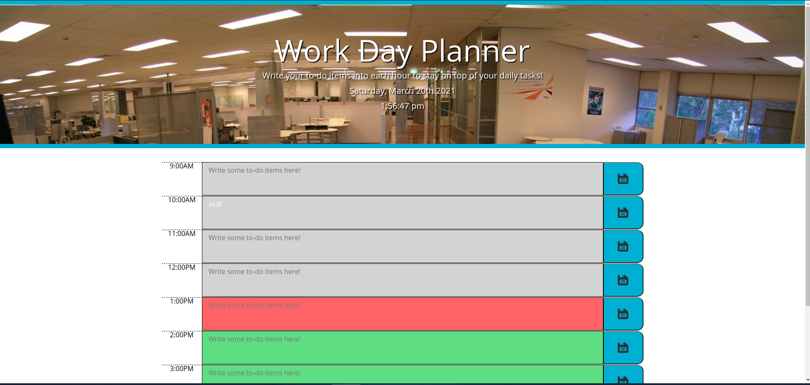

# Plan Your Day!

## Overview
* This website allows you to write agenda items for your workday down and return to them throughout the day. 
* It tracks elapsed hours by highlighting them gray; the current hour is highlighted in red; hours yet to pass are in green.
* It saves your agenda text to a JavaScript object tied to the current date, and drops it into your localStorage. That means don't clear your cache if you want to keep things!

## Ideas and known issues

* Currently, the time column which displays the hour wraps weirdly. I think a @media query could resolve this, but more research will let me know for sure. Bootstrap still confuses me!

* I would like to add more advanced cycling functionalities, to the point where you could uses the jQueryUI Datepicker to go to any calendar date, write and save agenda items, and have them load properly. 
